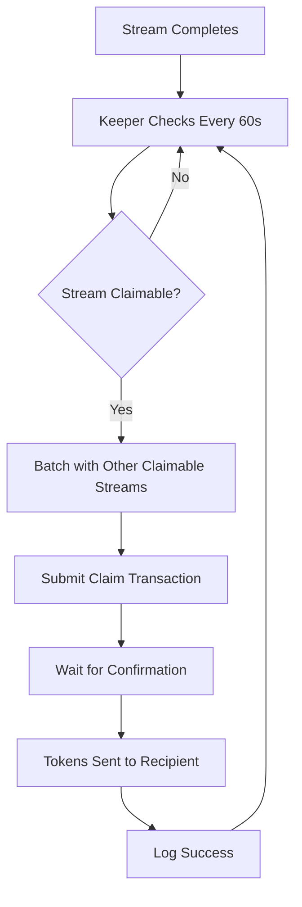

# Automatic Stream Claiming - Complete Guide

## Overview

The Liquifi Protocol now supports **automatic claiming** of completed streams through a **Stream Keeper** service that runs in the backend.

---

## How It Works

### The Problem
Blockchains can't execute transactions automatically. Streams need someone to call the `claim()` function to transfer tokens.

### The Solution
**3-Tier Auto-Claim System:**

1. **Backend Keeper Service** (Primary)
   - Monitors all streams every 60 seconds
   - Automatically claims completed streams
   - Batches multiple claims for gas efficiency

2. **Frontend Notifications** (Coming Soon)
   - Shows "Claim Available" badge on stream cards
   - One-click claim button

3. **Manual Trigger API**
   - REST endpoint to check/claim specific streams
   - Useful for testing and manual intervention

---

## Configuration

### Enable Auto-Claim

Edit `/backend/.env`:

```bash
# Enable automatic claiming
ENABLE_STREAM_KEEPER=true

# Mantle RPC (use official for reliability)
MANTLE_RPC_URL=https://rpc.sepolia.mantle.xyz

# StreamManager contract address
STREAM_MANAGER_ADDRESS=0x60bd590bc841D8558B279F064459a91Afd0d6015
```

### Disable Auto-Claim

Set `ENABLE_STREAM_KEEPER=false` or remove the variable.

---

## Features

### Automatic Detection

The keeper automatically:
- ✅ Finds all active streams
- ✅ Checks if they're completed (duration elapsed)
- ✅ Claims any claimable amounts
- ✅ Batches up to 10 streams per transaction
- ✅ Runs every 60 seconds

### Gas Optimization

- Claims multiple streams in one transaction
- Estimates gas dynamically (500k per stream)
- Uses the backend wallet to pay gas
- Recipients get tokens without paying gas!

### Safety Features

- Only claims streams that are fully completed
- Skips paused or inactive streams
- Handles RPC errors gracefully
- Logs all operations for monitoring

---

## API Endpoints

### Check Claimable Streams

```bash
GET /api/streams/claimable/:address

Example:
curl http://localhost:4000/api/streams/claimable/0x650cc24bDd96ca71e0390f8b0F3CC5c9e83341bC

Response:
{
  "address": "0x650cc24bDd96ca71e0390f8b0F3CC5c9e83341bC",
  "claimableStreams": [1, 5, 12],
  "count": 3
}
```

### Trigger Manual Claim Check

```bash
POST /api/streams/claim-all/:address

Example:
curl -X POST http://localhost:4000/api/streams/claim-all/0x650cc24bDd96ca71e0390f8b0F3CC5c9e83341bC

Response:
{
  "message": "Found 3 claimable streams. Keeper will process them automatically.",
  "claimableStreams": [1, 5, 12],
  "note": "The keeper service claims streams automatically every 60 seconds"
}
```

---

## Testing Auto-Claim

### Step 1: Create a Short Test Stream

```bash
# Create a 2-minute stream for testing
# Via CLI:
cast send 0x60bd590bc841D8558B279F064459a91Afd0d6015 \
  "createStream(address,address,uint256,uint256)" \
  <recipient> \
  0x5dB24867c863dE8262c12627381199556DF2d546 \
  1000000 \
  120 \
  --rpc-url https://rpc.sepolia.mantle.xyz \
  --private-key YOUR_KEY
```

### Step 2: Wait for Completion

Wait 2 minutes + 60 seconds (for keeper cycle).

### Step 3: Check Backend Logs

```bash
# Watch backend logs
cd backend && npm run dev

# Look for:
Stream keeper service started - auto-claiming every 60 seconds
Found claimable streams: [1]
Claim transaction submitted
Streams claimed successfully
```

### Step 4: Verify Recipient Balance

```bash
# Check if recipient received tokens
cast call 0x5dB24867c863dE8262c12627381199556DF2d546 \
  "balanceOf(address)" \
  <recipient> \
  --rpc-url https://rpc.sepolia.mantle.xyz
```

---

## Architecture



---

## Monitoring

### Backend Logs

The keeper logs important events:

```bash
[INFO] Stream keeper service started
[INFO] Checking for claimable streams...
[INFO] Found claimable streams: [1, 5, 12]
[INFO] Claiming stream batch
[INFO] Claim transaction submitted (txHash: 0x...)
[INFO] Streams claimed successfully (gasUsed: 1,234,567)
```

### Error Handling

If something goes wrong:

```bash
[ERROR] Failed to claim streams: <error message>
[DEBUG] Error checking stream 123: Stream not active
```

---

## Gas Costs

| Operation | Gas Used | Cost (Mantle) |
|-----------|----------|---------------|
| Single stream claim | ~150,000 | ~$0.003 |
| Batch 5 streams | ~600,000 | ~$0.012 |
| Batch 10 streams | ~1,100,000 | ~$0.022 |

**Who Pays?** The backend wallet (uses RISK_SIGNER_PRIVATE_KEY).

---

## Production Deployment

### Render Configuration

The keeper is already configured in `render.yaml`:

```yaml
services:
  - type: web
    name: streampay-backend
    envVars:
      - key: ENABLE_STREAM_KEEPER
        value: "true"
      - key: MANTLE_RPC_URL
        value: "https://rpc.sepolia.mantle.xyz"
```

### AWS/Heroku

Add environment variables in your platform's dashboard.

### Docker

```dockerfile
ENV ENABLE_STREAM_KEEPER=true
ENV MANTLE_RPC_URL=https://rpc.sepolia.mantle.xyz
ENV STREAM_MANAGER_ADDRESS=0x60bd590bc841D8558B279F064459a91Afd0d6015
```

---

## Troubleshooting

### Keeper Not Starting

**Check logs for:**
```
Stream keeper disabled (set ENABLE_STREAM_KEEPER=true to enable)
```

**Solution:** Set `ENABLE_STREAM_KEEPER=true` in `.env`

### No Streams Being Claimed

**Possible causes:**
1. No streams have completed yet
2. All claimable amounts are 0
3. RPC endpoint is down

**Check manually:**
```bash
curl http://localhost:4000/api/streams/claimable/YOUR_ADDRESS
```

### RPC Errors

**Error:** `HTTP 500 with body: Temporary internal error`

**Solution:** Change RPC in `.env`:
```bash
MANTLE_RPC_URL=https://mantle-sepolia.publicnode.com
```

---

## Advanced Configuration

### Custom Check Interval

Edit `/backend/src/services/streamKeeper.ts`:

```typescript
constructor(...) {
  this.checkInterval = 30000; // Check every 30 seconds
}
```

### Custom Batch Size

Edit the keeper service:

```typescript
const batchSize = 20; // Claim up to 20 streams per transaction
```

---

## Roadmap

### Planned Features

- [ ] Frontend notifications when streams are claimable
- [ ] Email/Push notifications for recipients
- [ ] Dashboard showing auto-claim statistics
- [ ] Configurable gas price strategies
- [ ] Multi-chain keeper support

---

## FAQ

**Q: Do recipients need to do anything?**  
A: No! Tokens arrive automatically when streams complete.

**Q: What if the backend goes down?**  
A: Recipients can still manually claim via the frontend or explorer.

**Q: Can I disable auto-claim for specific streams?**  
A: Not currently, but you can disable the entire keeper with `ENABLE_STREAM_KEEPER=false`.

**Q: How much MNT does the keeper wallet need?**  
A: ~0.1 MNT per 100 claims is sufficient on Mantle L2.

---

## Support

Issues? Questions?  
Open a GitHub issue or contact the team.

**Built with 💧 by the Liquifi team**
