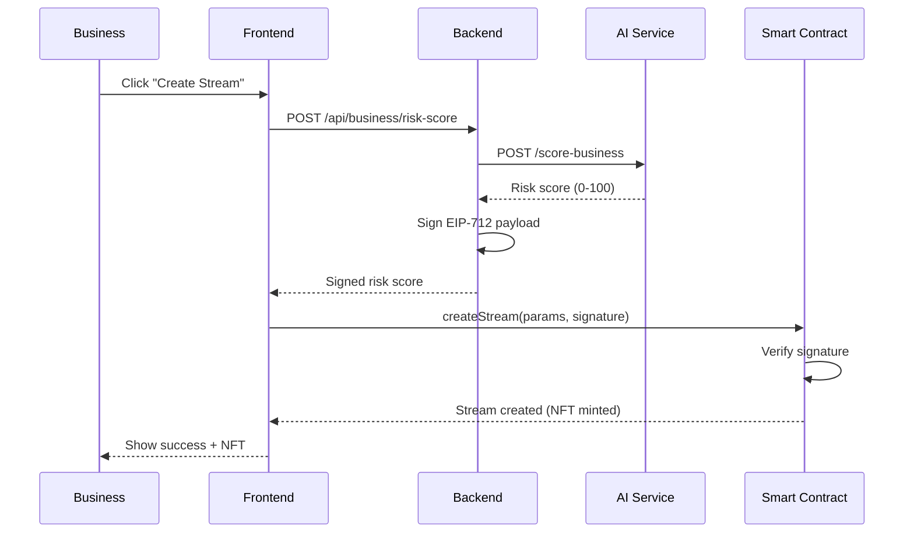

# Contributing to Liquifi Protocol

Thank you for your interest in contributing to Liquifi! This document provides guidelines and instructions for contributing to the project.

## Table of Contents

- [Code of Conduct](#code-of-conduct)
- [Getting Started](#getting-started)
- [Development Workflow](#development-workflow)
- [Contribution Types](#contribution-types)
- [Pull Request Process](#pull-request-process)
- [Coding Standards](#coding-standards)
- [Testing Guidelines](#testing-guidelines)
- [Documentation](#documentation)
- [Community](#community)

---

## Code of Conduct

### Our Pledge

We are committed to providing a welcoming and inclusive environment for all contributors, regardless of experience level, background, or identity.

### Expected Behavior

- Be respectful and considerate in all interactions
- Provide constructive feedback
- Focus on what's best for the project and community
- Show empathy towards other contributors

### Unacceptable Behavior

- Harassment, discrimination, or offensive comments
- Trolling, insulting, or derogatory remarks
- Publishing private information without consent
- Any conduct that could be considered unprofessional

---

## Getting Started

### Prerequisites

Ensure you have the following installed:

```bash
# Required
- Node.js >= 18.0.0
- npm >= 9.0.0
- Python >= 3.11
- Foundry (forge, cast, anvil)
- Git

# Recommended
- VS Code with Solidity extension
- MetaMask or compatible Web3 wallet
```

### Repository Setup

1. **Fork the repository**
   ```bash
   # Click "Fork" on GitHub, then clone your fork
   git clone https://github.com/YOUR_USERNAME/streampay-mantle.git
   cd streampay-mantle
   ```

2. **Add upstream remote**
   ```bash
   git remote add upstream https://github.com/Martins-O/StreamPay-Mantle.git
   git fetch upstream
   ```

3. **Install dependencies**
   ```bash
   # Smart contracts
   cd contracts && forge install && cd ..

   # Backend
   cd backend && npm install && cd ..

   # Frontend
   cd frontend && npm install && cd ..

   # AI Service
   cd ai-service && python -m venv .venv && source .venv/bin/activate && pip install -r requirements.txt && cd ..
   ```

4. **Set up environment variables**
   ```bash
   # Copy example files
   cp backend/.env.example backend/.env
   cp contracts/.env.example contracts/.env
   cp frontend/.env.example frontend/.env.local

   # Edit with your values (NEVER commit real keys!)
   # See .env.example files for required variables
   ```

5. **Run tests to verify setup**
   ```bash
   # Contracts
   cd contracts && forge test

   # Backend
   cd backend && npm test

   # Frontend
   cd frontend && npm run lint

   # AI Service
   cd ai-service && PYTHONPATH=. pytest
   ```

---

## Development Workflow

### Branch Naming Convention

Use descriptive branch names following this pattern:

```
<type>/<short-description>

Examples:
- feature/yield-pool-analytics
- fix/stream-cancelation-bug
- docs/deployment-guide
- refactor/backend-error-handling
```

**Branch Types:**
- `feature/` - New features or enhancements
- `fix/` - Bug fixes
- `docs/` - Documentation changes
- `refactor/` - Code refactoring without behavior changes
- `test/` - Adding or updating tests
- `chore/` - Maintenance tasks (dependencies, build scripts)

### Development Cycle

1. **Create a branch**
   ```bash
   git checkout -b feature/your-feature-name
   ```

2. **Make changes**
   - Write code following our [coding standards](#coding-standards)
   - Add tests for new functionality
   - Update documentation as needed

3. **Test locally**
   ```bash
   # Run relevant tests
   cd contracts && forge test
   cd backend && npm test
   cd frontend && npm run lint
   ```

4. **Commit changes**
   ```bash
   git add .
   git commit -m "feat: add yield pool analytics dashboard"
   ```

   **Commit Message Format:**
   ```
   <type>: <subject>

   [optional body]

   [optional footer]
   ```

   **Types:**
   - `feat`: New feature
   - `fix`: Bug fix
   - `docs`: Documentation changes
   - `style`: Code formatting (no logic changes)
   - `refactor`: Code restructuring
   - `test`: Adding/updating tests
   - `chore`: Maintenance tasks

5. **Push to your fork**
   ```bash
   git push origin feature/your-feature-name
   ```

6. **Open a Pull Request**
   - Go to GitHub and create a PR from your branch to `main`
   - Fill out the PR template completely
   - Link related issues

---

## Contribution Types

### 1. Bug Fixes

**Before submitting:**
- Search existing issues to avoid duplicates
- Verify the bug exists in the latest version
- Include reproduction steps in your PR

**Bug Fix Checklist:**
- [ ] Add test that reproduces the bug
- [ ] Fix the bug
- [ ] Verify test now passes
- [ ] Update documentation if behavior changed

### 2. New Features

**Before starting:**
- Open an issue to discuss the feature
- Wait for maintainer approval
- Break large features into smaller PRs

**Feature Checklist:**
- [ ] Add comprehensive tests
- [ ] Update relevant documentation
- [ ] Add TypeScript types (if applicable)
- [ ] Ensure backward compatibility
- [ ] Update CHANGELOG.md

### 3. Documentation

**Types of documentation:**
- Code comments (Solidity NatSpec, JSDoc)
- README updates
- Architecture docs in `/docs`
- API documentation
- Tutorial/guide creation

**Documentation Guidelines:**
- Use clear, concise language
- Include code examples
- Add diagrams for complex flows (Mermaid preferred)
- Test all commands and code snippets

### 4. Tests

**We always need more tests!**
- Smart contract unit tests (Foundry)
- Backend API tests (Vitest)
- Frontend component tests (React Testing Library)
- Integration tests
- E2E tests (Playwright - coming soon)

### 5. Performance Improvements

**Before optimizing:**
- Profile to identify actual bottlenecks
- Benchmark before and after changes
- Document performance gains in PR

**Areas for optimization:**
- Gas optimization in smart contracts
- API response times
- Frontend bundle size
- Database query performance

---

## Pull Request Process

### PR Template

When creating a PR, fill out the template:

```markdown
## Description
Brief summary of changes

## Type of Change
- [ ] Bug fix (non-breaking change)
- [ ] New feature (non-breaking change)
- [ ] Breaking change (fix or feature that changes existing behavior)
- [ ] Documentation update

## Testing
- [ ] Tests pass locally
- [ ] New tests added for new functionality
- [ ] Manual testing performed

## Checklist
- [ ] Code follows project style guidelines
- [ ] Self-reviewed code
- [ ] Commented complex code sections
- [ ] Updated documentation
- [ ] No new warnings
- [ ] Added tests that prove fix/feature works
- [ ] Dependent changes merged

## Related Issues
Closes #123
```

### Review Process

1. **Automated Checks**
   - CI/CD pipeline runs tests
   - Linting checks
   - Build verification

2. **Code Review**
   - At least one maintainer approval required
   - Address all review comments
   - Request re-review after changes

3. **Merge**
   - Squash commits for cleaner history
   - Delete branch after merge

---

## Coding Standards

### Smart Contracts (Solidity)

```solidity
// ✅ GOOD
/**
 * @notice Creates a new revenue stream
 * @param recipient Address receiving the stream
 * @param amount Total amount to stream
 * @param duration Stream duration in seconds
 * @return streamId Unique identifier for the stream
 */
function createStream(
    address recipient,
    uint256 amount,
    uint256 duration
) external returns (uint256 streamId) {
    require(recipient != address(0), "Invalid recipient");
    require(amount > 0, "Amount must be positive");
    require(duration > 0, "Duration must be positive");
    
    // Implementation...
}

// ❌ BAD - Missing NatSpec, unclear variable names
function create(address a, uint256 b, uint256 c) external returns (uint256) {
    require(a != address(0));
    require(b > 0 && c > 0);
    // ...
}
```

**Solidity Best Practices:**
- Follow [Solidity Style Guide](https://docs.soliditylang.org/en/latest/style-guide.html)
- Use NatSpec comments for all public/external functions
- Prefer explicit visibility modifiers
- Use custom errors over `require` strings (gas optimization)
- Order functions: constructor, receive, fallback, external, public, internal, private
- Run `forge fmt` before committing

### TypeScript (Backend/Frontend)

```typescript
// ✅ GOOD
interface StreamParams {
  recipient: string;
  amount: bigint;
  duration: number;
}

async function createStream(params: StreamParams): Promise<string> {
  const { recipient, amount, duration } = params;
  
  if (!isAddress(recipient)) {
    throw new Error('Invalid recipient address');
  }
  
  // Implementation...
  return streamId;
}

// ❌ BAD - No types, unclear naming
async function create(r, a, d) {
  if (!check(r)) throw new Error('bad');
  // ...
}
```

**TypeScript Best Practices:**
- Use strict TypeScript (`strict: true` in tsconfig.json)
- Prefer interfaces over types for object shapes
- Use descriptive variable names (no single letters except loop counters)
- Use async/await over raw Promises
- Handle errors explicitly (try/catch or .catch())
- Run `npm run lint` before committing

### Python (AI Service)

```python
# ✅ GOOD
from pydantic import BaseModel, Field

class BusinessProfile(BaseModel):
    """Business profile for risk assessment."""
    monthly_revenue: float = Field(gt=0, description="Monthly revenue in USD")
    volatility: float = Field(ge=0, le=100, description="Revenue volatility %")
    missed_payments: int = Field(ge=0, description="Count of missed payments")

def calculate_risk_score(profile: BusinessProfile) -> int:
    """
    Calculate deterministic risk score (0-100).
    
    Args:
        profile: Business financial profile
        
    Returns:
        Risk score where higher = lower risk
    """
    # Implementation...
    return score

# ❌ BAD - No types, no validation
def calc(r, v, m):
    return some_calculation()
```

**Python Best Practices:**
- Use type hints for all function signatures
- Follow PEP 8 style guide
- Use Pydantic for data validation
- Write docstrings for all public functions
- Run `black` and `flake8` before committing

### General Guidelines

- **DRY**: Don't Repeat Yourself - extract reusable functions
- **KISS**: Keep It Simple, Stupid - prefer clarity over cleverness
- **Comments**: Explain *why*, not *what* (code should be self-documenting)
- **Error Handling**: Always handle errors explicitly
- **Security**: Never trust user input, validate everything

---

## Testing Guidelines

### Smart Contracts

```solidity
// contracts/test/StreamEngine.t.sol
contract StreamEngineTest is Test {
    StreamEngine public engine;
    
    function setUp() public {
        engine = new StreamEngine();
    }
    
    function testCreateStream() public {
        // Arrange
        address recipient = makeAddr("recipient");
        uint256 amount = 1000e18;
        
        // Act
        uint256 streamId = engine.createStream(recipient, amount, 30 days);
        
        // Assert
        assertEq(engine.getStreamRecipient(streamId), recipient);
        assertEq(engine.getStreamAmount(streamId), amount);
    }
    
    function testRevertInvalidRecipient() public {
        vm.expectRevert("Invalid recipient");
        engine.createStream(address(0), 1000e18, 30 days);
    }
}
```

**Testing Requirements:**
- Test happy path and edge cases
- Test revert conditions with `vm.expectRevert`
- Use fuzz testing for numerical functions
- Aim for >90% code coverage
- Run `forge test -vvv` for detailed output

### Backend API

```typescript
// backend/test/api.test.ts
import { describe, it, expect } from 'vitest';
import request from 'supertest';
import { app } from '../src/app';

describe('POST /api/business/register', () => {
  it('should register a new business', async () => {
    const response = await request(app)
      .post('/api/business/register')
      .send({
        name: 'TechCorp',
        monthlyRevenue: 50000,
        volatility: 10
      });
      
    expect(response.status).toBe(201);
    expect(response.body).toHaveProperty('businessId');
  });
  
  it('should reject invalid revenue', async () => {
    const response = await request(app)
      .post('/api/business/register')
      .send({ monthlyRevenue: -1000 });
      
    expect(response.status).toBe(400);
  });
});
```

### Frontend Components

```typescript
// frontend/src/components/StreamCard.test.tsx
import { render, screen } from '@testing-library/react';
import { StreamCard } from './StreamCard';

describe('StreamCard', () => {
  it('renders stream details', () => {
    render(
      <StreamCard
        streamId="1"
        recipient="0x123..."
        amount={1000n}
        status="active"
      />
    );
    
    expect(screen.getByText('Stream #1')).toBeInTheDocument();
    expect(screen.getByText('Active')).toBeInTheDocument();
  });
});
```

---

## Documentation

### Code Documentation

**Solidity (NatSpec):**
```solidity
/**
 * @title StreamEngine
 * @notice Manages multi-token revenue streams
 * @dev Implements EIP-712 for risk score verification
 */
contract StreamEngine {
    /**
     * @notice Creates a new revenue stream
     * @dev Emits StreamCreated event
     * @param recipient Address receiving streamed tokens
     * @param amount Total amount to stream
     * @return streamId Unique identifier for the created stream
     */
    function createStream(address recipient, uint256 amount) 
        external 
        returns (uint256 streamId) 
    {
        // Implementation
    }
}
```

**TypeScript (JSDoc):**
```typescript
/**
 * Creates a new revenue stream on-chain
 * @param recipient - Ethereum address receiving the stream
 * @param amount - Total amount to stream (in wei)
 * @param duration - Stream duration in seconds
 * @returns Promise resolving to transaction hash
 * @throws {Error} If recipient is invalid or amount is zero
 */
async function createStream(
  recipient: string,
  amount: bigint,
  duration: number
): Promise<string> {
  // Implementation
}
```

### Architecture Documentation

Add Mermaid diagrams for complex flows:

```markdown
## Stream Creation Flow


```

---

## Community

### Communication Channels

- **GitHub Issues**: Bug reports, feature requests
- **GitHub Discussions**: General questions, ideas
- **Twitter**: [@liquifi](https://twitter.com/liquifi)
- **Discord**: Coming soon

### Getting Help

**Before asking for help:**
1. Read the documentation in `/docs`
2. Search existing GitHub issues
3. Check recent pull requests for similar work

**When asking for help:**
- Provide context (what you're trying to do)
- Include error messages and stack traces
- Share relevant code snippets
- Mention what you've already tried

### Recognition

Contributors will be:
- Added to CONTRIBUTORS.md
- Mentioned in release notes
- Eligible for future contributor rewards program

---

## License

By contributing, you agree that your contributions will be licensed under the MIT License.

---

## Questions?

Open a [GitHub Discussion](https://github.com/Martins-O/StreamPay-Mantle/discussions) or reach out to the maintainers.

Thank you for contributing to Liquifi! 💧
