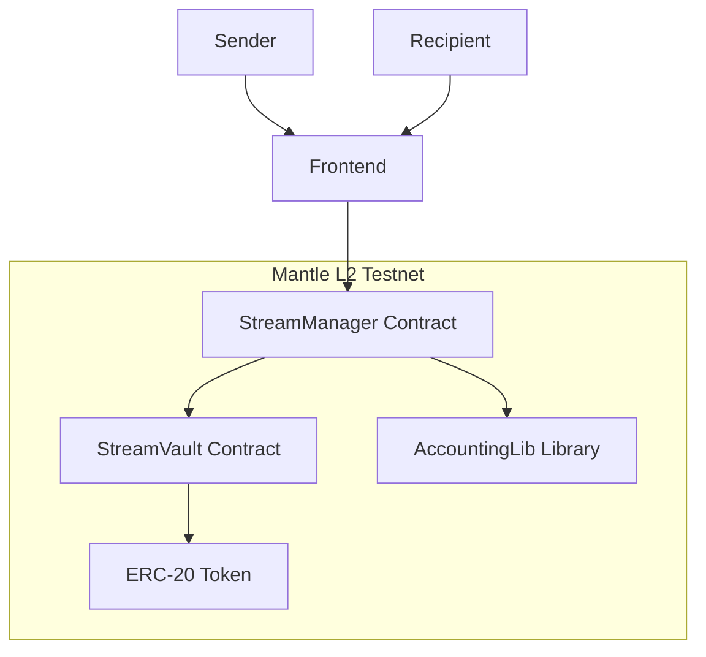

# 🌊 StreamPay Mantle

**Real-time payment streaming protocol on Mantle L2 testnet**

StreamPay allows users to continuously stream ERC-20 tokens to recipients over time. The amount accumulates block-by-block, and recipients can claim at any time. Senders can cancel or pause streams.


## 🎯 Overview

StreamPay Mantle enables:
- **Real-time token streaming** with second-by-second precision
- **Flexible claiming** - recipients can claim accrued amounts anytime
- **Sender control** - cancel streams and reclaim remaining tokens
- **Low-cost operations** on Mantle L2 for minimal gas fees
- **Live visualization** with animated flow counters

## 🏗️ Architecture



### Core Components

1. **StreamManager.sol** - Main contract handling stream lifecycle
2. **StreamVault.sol** - Secure token escrow and withdrawal
3. **AccountingLib.sol** - Pure math for streaming calculations
4. **Frontend** - Vite + React + Wagmi for wallet integration and real-time UI

## 🚀 Quick Start

### Prerequisites

- Node.js 18+
- Git
- MetaMask or compatible wallet
- Mantle testnet MNT tokens

### 1. Clone Repository

```bash
git clone https://github.com/yourusername/streampay-mantle.git
cd streampay-mantle
```

### 2. Deploy Contracts

```bash
cd contracts
cp .env.example .env
# Edit .env with your private key and Mantlescan API key

# Run tests
forge test

# Deploy to Mantle testnet
./deploy.sh
```

### 3. Setup Frontend

```bash
cd ../frontend
cp .env.example .env.local
# Populate contract addresses from deployment
#   VITE_STREAM_MANAGER_ADDRESS=
#   VITE_STREAM_VAULT_ADDRESS=
#   VITE_MOCK_USDT_ADDRESS=
# Optional: set VITE_WALLETCONNECT_PROJECT_ID for WalletConnect support

npm install
npm run dev
```

### 4. Access Application

Open [http://localhost:3000](http://localhost:3000) and:
1. Connect your wallet (MetaMask, browser extension, or WalletConnect)
2. Switch to Mantle testnet
3. Mint mock USDT using the deployed token contract
4. Create your first stream!

## 📋 Features

### ✅ Implemented

- [x] **Core Streaming Logic**
  - Create streams with custom duration and amount
  - Real-time calculation of streamable amounts
  - Cancel streams with automatic refunds

- [x] **Smart Contracts**
  - Comprehensive test suite (30 tests, 100% pass rate)
  - Gas-optimized Solidity 0.8.30
  - OpenZeppelin security standards
  - Event emission for indexing

- [x] **Frontend Interface**
  - Wallet connection (MetaMask, WalletConnect QR, browser extensions)
  - Real-time animated counters
  - Stream visualization charts
  - Responsive design with Tailwind CSS

- [x] **Developer Experience**
  - Automated deployment scripts
  - Contract verification on Mantlescan
  - TypeScript throughout
  - Comprehensive documentation

### 🔮 Future Improvements

- [ ] **Pause/Resume Streams** - Temporarily halt streaming
- [ ] **Batch Payroll** - Create multiple streams in one transaction
- [ ] **NFT Stream Receipts** - Mint NFTs representing streams
- [ ] **Multi-token Support** - Stream different ERC-20 tokens
- [ ] **Stream Templates** - Save and reuse common configurations
- [ ] **Notification System** - Alerts for claims and cancellations

## 🔧 Technical Details

### Gas Optimization

- **Stream Creation**: ~358,000 gas
- **Claim**: ~399,000 gas
- **Cancel**: ~388,000 gas

### Security Features

- Reentrancy protection with OpenZeppelin guards
- Pausable contract for emergency stops
- Safe math for all calculations (Solidity 0.8+)
- Comprehensive input validation

### Precision

- Rate calculations use second-precision
- No floating point - all integer arithmetic
- Rounding handled correctly for edge cases

## 📚 API Reference

### Core Functions

#### `createStream(recipient, token, totalAmount, duration)`
Creates a new payment stream.

**Parameters:**
- `recipient` (address): Receiver of the stream
- `token` (address): ERC-20 token contract address
- `totalAmount` (uint256): Total tokens to stream
- `duration` (uint256): Stream duration in seconds

**Returns:** Stream ID (uint256)

#### `claim(streamId)`
Claims accumulated tokens from a stream.

**Parameters:**
- `streamId` (uint256): ID of the stream to claim from

#### `cancelStream(streamId)`
Cancels a stream and refunds remaining tokens.

**Parameters:**
- `streamId` (uint256): ID of the stream to cancel

### View Functions

#### `getStreamableAmount(streamId)`
Returns currently claimable amount for a stream.

#### `getStream(streamId)`
Returns complete stream information.

## 🧪 Testing

The project includes comprehensive test coverage:

```bash
cd contracts
forge test -vv
```

**Test Results:**
```
Ran 4 test suites: 30 tests passed, 0 failed
- StreamManager: 14 tests
- StreamVault: 3 tests
- AccountingLib: 11 tests
- Integration: 2 tests
```

## 🌐 Deployment

### Mantle Testnet

- **Network ID**: 5003
- **RPC**: https://rpc.testnet.mantle.xyz
- **Explorer**: https://explorer.testnet.mantle.xyz

### Contract Addresses

After deployment, addresses are saved to `deployment.env`:

```bash
STREAM_MANAGER_ADDRESS=0x...
STREAM_VAULT_ADDRESS=0x...
MOCK_USDT_ADDRESS=0x...
```

## 🤝 Contributing

1. Fork the repository
2. Create a feature branch (`git checkout -b feature/amazing-feature`)
3. Commit changes (`git commit -m 'Add amazing feature'`)
4. Push to branch (`git push origin feature/amazing-feature`)
5. Open a Pull Request

### Development Setup

```bash
# Install dependencies
npm install -g @foundry-rs/foundry

# Contract development
cd contracts
forge install
forge test

# Frontend development
cd frontend
npm install
npm run dev
```

## 📄 License

This project is licensed under the MIT License - see the [LICENSE](LICENSE) file for details.

## 🙏 Acknowledgments

- **Mantle Network** for the L2 infrastructure
- **OpenZeppelin** for secure contract libraries
- **Wagmi** for excellent Web3 React hooks
- **Foundry** for fast Solidity development

## 📞 Support

- **GitHub Issues**: [Report bugs or request features](https://github.com/yourusername/streampay-mantle/issues)
- **Documentation**: [Full technical docs](./docs/)
- **Discord**: [Join our community](https://discord.gg/streampay)

---

**Built with ❤️ for the Mantle ecosystem**
