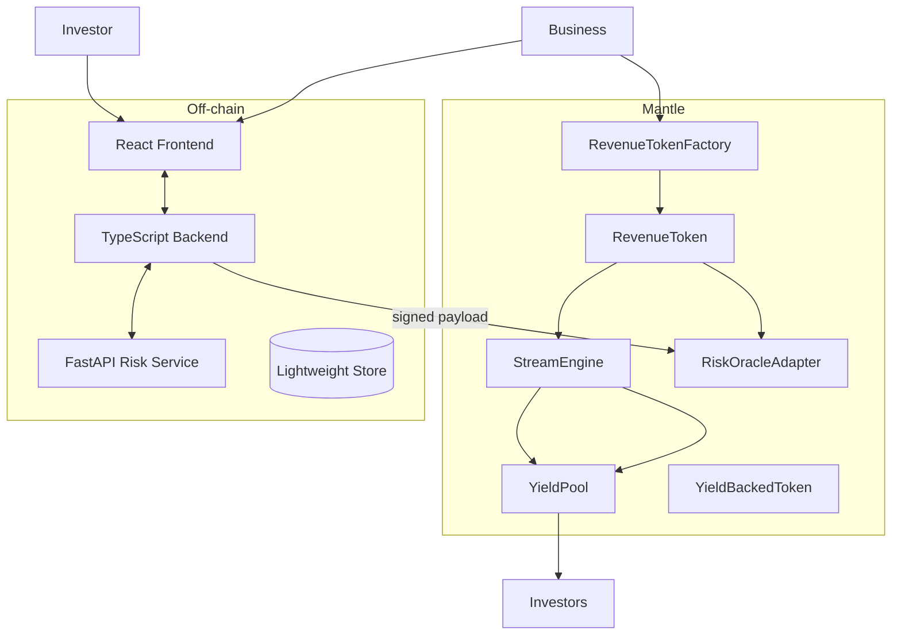

# Mantle StreamYield

> AI-powered tokenized cashflow + yield streaming protocol for real-world businesses on Mantle.

Mantle StreamYield extends the original StreamPay contracts into a full-stack RealFi rail:

- **Businesses** tokenize subscriptions, invoices, or rent into `RevenueToken`s, stream repayments via the `StreamEngine`, and publish AI-signed risk updates.
- **Investors** deposit stablecoins into `YieldPool`s, receive `YieldBackedToken` shares, and earn pro-rata yield the moment revenue flows in.
- **AI Risk Service** continuously scores each merchant, the backend signs payloads, and `RiskOracleAdapter` enforces exposure on-chain.

## System Architecture



### Repo Layout

| Path | Purpose |
| --- | --- |
| `contracts/` | Foundry workspace with `RevenueTokenFactory`, `RevenueToken`, `YieldPool`, `YieldBackedToken`, `RiskOracleAdapter`, and `StreamEngine` (wrapper around legacy streaming logic). |
| `frontend/` | Vite + React app (Wagmi, shadcn) with Landing, Business Dashboard, Investor Dashboard, and the legacy streaming console. |
| `backend/` | Node.js + Express API for business registration, AI orchestration, and risk signing. Includes Vitest coverage for the risk service. |
| `ai-service/` | FastAPI microservice producing deterministic risk scores based on revenue + volatility inputs. |
| `docs/` | Architecture notes, deployment checklist, demo script, and the new `pitch.md`. |

## Getting Started

### 0. Environment checklist

1. `cp contracts/.env.example contracts/.env` and fill `PRIVATE_KEY`, RPC URLs, and (optionally) `RISK_SIGNER_ADDRESS`. When omitted, the deployer address becomes the signer used by the backend + oracle.
2. `cp backend/.env.example backend/.env` and set `AI_SERVICE_URL`, `RISK_SIGNER_PRIVATE_KEY`, and `RISK_ORACLE_ADDRESS` (after deployment).
3. `cp frontend/.env.example frontend/.env.local` and paste the deployed contract addresses once the Foundry script runs.
4. `cd ai-service && ./setup.sh` to create the virtualenv and install FastAPI deps.

### 1. Contracts (Mantle)

```bash
cd contracts
cp .env.example .env   # fill PRIVATE_KEY, RPC_URL, optional overrides
forge test              # runs StreamYield integration tests
./deploy.sh             # deploy StreamEngine, YieldPool, oracle, factory
# copy the printed addresses into contracts/deployment.env, backend/.env, frontend/.env.local
```

### 2. Backend API

```bash
cd backend
cp .env.example .env
# edit PORT, AI_SERVICE_URL, RISK_SIGNER_PRIVATE_KEY, RISK_ORACLE_ADDRESS, etc.
npm install
npm run dev             # Express server on http://localhost:4000
# npm test              # Vitest suite covering risk signing helpers
```

### 3. AI Risk Microservice

```bash
cd ai-service
python3 -m venv .venv && source .venv/bin/activate
pip install -r requirements.txt
uvicorn app:app --reload --port 8001
```

### 4. Frontend

```bash
cd frontend
cp .env.example .env.local
# populate VITE_* addresses (StreamEngine, RevenueFactory, YieldPool, backend URL)
npm install
npm run dev             # Vite dev server on http://localhost:3000
```

### Dev Workflow

1. Start the AI service (`cd ai-service && source .venv/bin/activate && uvicorn app:app --reload --port 8001`) or run all components via `./start-services.sh` from repo root.
2. Boot the backend (`cd backend && npm run dev`). It loads contract/risk addresses from `.env`, polls the AI service, signs payloads, and exposes `/api/*` routes + metrics.
3. Launch the frontend (`cd frontend && npm run dev`) to access landing, Business workspace, Investor cockpit, and the legacy console.
4. Touch the legacy `/legacy-console` route whenever you need the original multi-stream tooling.

## Key Features

- **RevenueTokenFactory + RevenueToken** – tokenizes future cashflow with expected revenue / tenor metadata. Businesses or the factory can link tokens to pools.
- **YieldPool + YieldBackedToken** – share-based pool with live `totalAssets`, capacity caps derived from AI risk band, and `deposit/withdraw/onRevenueReceived` flows.
- **RiskOracleAdapter** – verifies ECDSA payloads from the backend signer, stores score + band, and exposes data to pools or UIs.
- **StreamEngine** – wraps the proven `StreamManager` streaming code while tagging streams with YieldPool metadata.
- **Backend API** – handles business registration, fetches AI scores, signs risk payloads, and exposes investor-ready pool metrics.
- **AI Microservice** – FastAPI scoring endpoint with deterministic rules using revenue / volatility / missed payments → `LOW/MEDIUM/HIGH` bands.
- **Frontend UX**
  - Landing page rethemed for Mantle StreamYield with CTA for Businesses vs Investors.
  - Business dashboard: register profile, refresh AI risk, mint RevenueTokens via Wagmi, and view live streams.
  - Investor dashboard: browse pools, view Mantle metrics, approve + deposit stablecoins into YieldPool contracts.

## Testing

| Layer | Command |
| --- | --- |
| Smart contracts | `cd contracts && forge test` |
| Backend | `cd backend && npm test` (Vitest) |
| Frontend | `cd frontend && npm run lint` / `npm run test` (if configured) |

> The forge suite covers the new StreamYield integration: RevenueToken minting, capacity gating from `RiskOracleAdapter`, and signature validation. Backend Vitest specs cover risk-payload signing (requires Node deps).

## Demo Script

1. **Business flow**
   - Connect wallet on `/business`, register company metadata.
   - Refresh risk score – backend calls the AI service, signs payload, and the UI shows band + timestamp.
   - Mint a `RevenueToken` (uses Wagmi + Factory). Stream assets via `/dashboard` (legacy console) into the selected `YieldPool`.
2. **Investor flow**
   - Visit `/investor`, pick a pool, review AI risk & APY, approve USDC, and deposit. The UI calls `deposit()` on the configured YieldPool.
3. **Risk telemetry**
   - Trigger `/api/business/:address/risk` to push a new score. The risk band instantly updates on both dashboards.

## Why Mantle

- **Ultra-low fees**: The StreamEngine mints NFTs + streams multiple ERC-20s for pennies on Mantle testnet.
- **Modular stack**: Mantle’s modular rollup lets us compose RealFi rails (revenue tokens + AI oracles) without touching L1.
- **RealFi focus**: Mantle’s 2025 hackathon theme aligns with tokenized cashflow + AI underwriting — StreamYield showcases a full vertical slice.

## Docs & Pitch

See `docs/` for architecture, deployment steps, and the new [`docs/pitch.md`](docs/pitch.md) cheat sheet for hackathon judges.
