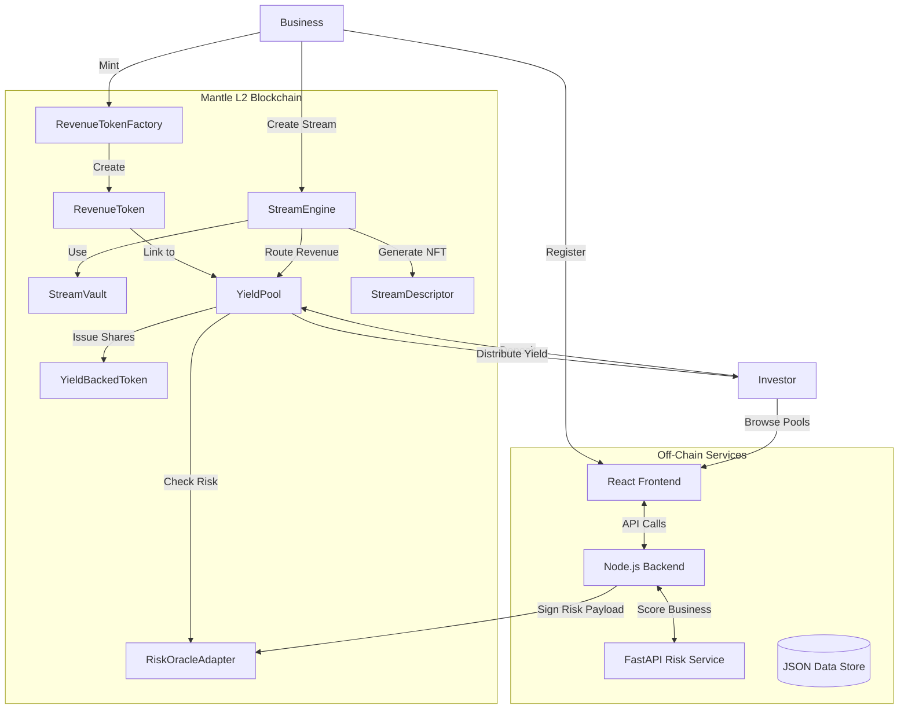

# Liquifi Protocol

<div align="center">

**Instant Liquidity for Future Revenue**

[](https://opensource.org/licenses/MIT)
[]( https://mantle.xyz)
[](https://github.com/Martins-O/StreamPay-Mantle/actions)

*AI-powered revenue streaming protocol for real-world businesses on Mantle L2*

[🌐 Website](https://liquifi.io) • [📖 Docs](./docs/) • [💬 Twitter](https://twitter.com/liquifi) • [📺 Demo](#demo)

</div>

---

## 🌊 What is Liquifi?

Liquifi transforms future revenue into instant capital. We solve the $10 trillion working capital problem by letting businesses tokenize invoices, subscriptions, and receivables—then access immediate liquidity from investors earning real-world yield.

**For Businesses:**  Turn tomorrow's revenue into today's capital
**For Investors:** Earn 8-12% APY from real cashflows with AI-managed risk

### The Problem
- Businesses wait 30-60 days to get paid on invoices
- $10+ trillion trapped in B2B receivables globally
- Traditional invoice factoring charges 15-30% APR
- SMBs can't access affordable working capital

### The Liquifi Solution
1. **Tokenize Revenue**: Businesses mint RevenueTokens backed by future cashflows
2. **AI Risk Scoring**: Automatic risk assessment (LOW/MEDIUM/HIGH bands)
3. **Instant Liquidity**: Investors deposit into YieldPools, businesses get capital immediately
4. **Stream Repayments**: Revenue streams in real-time as payments arrive
5. **Earn Yield**: Investors earn pro-rata from streamed revenue

---

## 🏗️ System Architecture


```mermaid
graph TD
    subgraph "Mantle L2 Blockchain"
        RF[RevenueTokenFactory]
        RT[RevenueToken]
        SE[StreamEngine]
        SV[StreamVault]
        YP[YieldPool]
        YBT[YieldBackedToken]
        RO[RiskOracleAdapter]
        SD[StreamDescriptor]
    end

    subgraph "Off-Chain Services"
        FE[React Frontend]
        BE[Node.js Backend]
        AI[FastAPI Risk Service]
        DS[(JSON Data Store)]
    end

    Business -->|Register| FE
    Investor -->|Browse Pools| FE
    FE <-->|API Calls| BE
    BE <-->|Score Business| AI
    BE -->|Sign Risk Payload| RO

    Business -->|Mint| RF
    RF -->|Create| RT
    RT -->|Link to| YP
    Business -->|Create Stream| SE
    SE -->|Route Revenue| YP
    SE -->|Use| SV
    YP -->|Issue Shares| YBT
    YP -->|Check Risk| RO
    SE -->|Generate NFT| SD
    Investor -->|Deposit| YP
    YP -->|Distribute Yield| Investor
```

### Repository Structure

| Directory | Purpose |
|-----------|---------|
| `contracts/` | Foundry workspace: 12 Solidity contracts (~2,500 LOC) |
| `frontend/` | React + Vite + Wagmi: Business & Investor dashboards |
| `backend/` | Express API: Business registration, risk signing, pool metrics |
| `ai-service/` | FastAPI: Deterministic risk scoring engine |
| `docs/` | Architecture, deployment, demo guides |

---

## ⚡ Quick Start for Judges

### Prerequisites
- MetaMask or compatible Web3 wallet
- Mantle Sepolia testnet configured (Chain ID: 5003)
- Testnet MNT from [Mantle Faucet](https://faucet.sepolia.mantle.xyz/)

### Live Deployment (Mantle Sepolia Testnet)

| Contract | Address | Explorer |
|----------|---------|----------|
| StreamEngine | `0x60bd590bc841D8558B279F064459a91Afd0d6015` | [View →](https://explorer.sepolia.mantle.xyz/address/0x60bd590bc841D8558B279F064459a91Afd0d6015) |
| YieldPool | `0x9187487Bd77c200d7f1Fa798c797D1a6cC65627D` | [View →](https://explorer.sepolia.mantle.xyz/address/0x9187487Bd77c200d7f1Fa798c797D1a6cC65627D) |
| RiskOracleAdapter | `0x49387C2bbF79348e80809eb534542E70ff139fEA` | [View →](https://explorer.sepolia.mantle.xyz/address/0x49387C2bbF79348e80809eb534542E70ff139fEA) |
| RevenueTokenFactory | `0x6f0021c43d7b26A8058EC7880df807B65727A33E` | [View →](https://explorer.sepolia.mantle.xyz/address/0x6f0021c43d7b26A8058EC7880df807B65727A33E) |
| Mock USDT | `0x5dB24867c863dE8262c12627381199556DF2d546` | [View →](https://explorer.sepolia.mantle.xyz/address/0x5dB24867c863dE8262c12627381199556DF2d546) |

### 5-Minute Test Flow

1. **Get testnet funds**: Visit [Mantle Faucet](https://faucet.sepolia.mantle.xyz/)
2. **Business setup**: Go to `/business`, register profile, refresh AI risk score
3. **Mint revenue token**: Enter expected revenue ($50k) and tenor (30 days)
4. **View streams**: See NFT visualization with real-time status
5. **Investor flow**: Switch to `/investor`, deposit USDT to earn yield

### Run Locally

```bash
# Clone repository
git clone https://github.com/Martins-O/StreamPay-Mantle.git
cd StreamPay-Mantle

# Start all services
./start-services.sh

# Or start individually:
# Terminal 1: AI Service
cd ai-service && source .venv/bin/activate && uvicorn app:app --reload --port 8001

# Terminal 2: Backend
cd backend && npm install && npm run dev

# Terminal 3: Frontend
cd frontend && npm install && npm run dev
```

Visit `http://localhost:3000` to explore:
- **`/business`** - Business dashboard with AI risk scoring
- **`/investor`** - Investor pools and yield tracking
- **`/legacy-console`** - Advanced stream management

---

## 🎯 Key Features

### Smart Contracts (Solidity 0.8.30)
- ✅ **StreamEngine**: Multi-token streaming with pause/resume
- ✅ **YieldPool**: Share-based yield vault with risk-gated capacity
- ✅ **RevenueToken**: ERC-20 tokens representing future cashflows
- ✅ **RiskOracleAdapter**: EIP-712 signed risk scores enforced on-chain
- ✅ **StreamDescriptor**: On-chain SVG NFT metadata for stream receipts
- ✅ **StreamVault**: Escrow with yield strategy hooks

### AI Risk Management
- **Deterministic Scoring**: Revenue, volatility, payment history → 0-100 score
- **Risk Bands**: LOW (75+), MEDIUM (55-74), HIGH (<55)
- **Capacity Gating**: Pools adjust limits based on risk (120%/90%/60%)
- **EIP-712 Signatures**: Backend signs, contracts verify on-chain
- **Revenue Verification**: +5 score boost for externally verified data

### Frontend Experience
- **Business Dashboard**: Register, get AI scores, mint RevenueTokens, view stream NFTs
- **Investor Dashboard**: Browse pools, view metrics (APY, TVL, risk), deposit/withdraw
- **Stream Visualization**: Real-time NFT cards showing Active/Paused/Inactive status
- **Legacy Console**: Power-user tools for batch operations, advanced stream management
- **Responsive Design**: TailwindCSS + shadcn/ui components

### Performance
- **Gas Efficiency**: ~$0.01 per stream on Mantle L2 (~358k gas)
- **Real-Time Precision**: ±1 second streaming accuracy
- **Frontend Load**: <2 seconds
- **AI Scoring**: <500ms response time
- **Backend SLA**: <60 seconds for risk payload signing

---

## 🧪 Testing

| Layer | Command | Status |
|-------|---------|--------|
| Smart Contracts | `cd contracts && forge test` | ✅ 29 tests passing |
| Backend | `cd backend && npm test` | ✅ 1 test passing |
| Frontend | `cd frontend && npm run lint` | ✅ 0 errors |
| AI Service | `cd ai-service && PYTHONPATH=. pytest` | ✅ 5 tests passing |

**Test Coverage:**
- Stream lifecycle (create, claim, cancel, pause, resume, extend, topup)
- Multi-token streaming
- Batch operations
- Risk-gated pool capacity
- EIP-712 signature verification
- NFT metadata generation
- Yield distribution calculations

---

## 📊 Demo Scenario

### Scenario: SaaS Business Needs Working Capital

**TechCorp** has $50k monthly recurring revenue but waits 30 days for customer payments.

**Traditional Solution:** Invoice factoring at 20% APR = $10k/year in fees

**Liquifi Solution:**

1. **Register & Score**
   - TechCorp registers on Business Dashboard
   - AI scores: Revenue=$50k, Volatility=10%, Missed=0 → Score: 82 (LOW risk)

2. **Tokenize Revenue**
   - Mint RevenueToken for $50k expected over 30 days
   - Link to Primary YieldPool

3. **Get Instant Liquidity**
   - Investors see LOW risk pool, deposit $40k USDT
   - TechCorp receives $40k instantly (80% LTV, within 120% LOW band capacity)
   - Creates stream routing payments to YieldPool

4. **Stream Repayments**
   - As TechCorp's customers pay, revenue streams to YieldPool
   - Investors earn yield in real-time (target: 10% APY)
   - Total cost to TechCorp: ~$4k vs $10k with traditional factoring

5. **Everyone Wins**
   - Business: 60% cheaper than factoring
   - Investors: 10% APY from real revenue
   - Protocol: Fee capture from volume

---

## 🔑 Environment Setup

### 1. Contracts (`contracts/.env`)
```bash
PRIVATE_KEY=your_private_key_here
RISK_SIGNER_ADDRESS=your_signer_address
MANTLE_TESTNET_RPC=https://rpc.sepolia.mantle.xyz
```

### 2. Backend (`backend/.env`)
```bash
PORT=4000
AI_SERVICE_URL=http://localhost:8001
RISK_SIGNER_PRIVATE_KEY=0x...
RISK_ORACLE_ADDRESS=0x49387C2bbF79348e80809eb534542E70ff139fEA
RISK_ORACLE_CHAIN_ID=5003
ALLOWED_ORIGINS=*
```

### 3. Frontend (`frontend/.env.local`)
```bash
VITE_STREAM_MANAGER_ADDRESS=0x60bd590bc841D8558B279F064459a91Afd0d6015
VITE_REVENUE_FACTORY_ADDRESS=0x6f0021c43d7b26A8058EC7880df807B65727A33E
VITE_RISK_ORACLE_ADDRESS=0x49387C2bbF79348e80809eb534542E70ff139fEA
VITE_PRIMARY_YIELD_POOL=0x9187487Bd77c200d7f1Fa798c797D1a6cC65627D
VITE_MANTLE_RPC_URL=https://mantle-sepolia.drpc.org
VITE_BACKEND_API_URL=http://localhost:4000
```

---

## 🚀 Deployment

### Render (Cloud Hosting)

See [RENDER_DEPLOYMENT.md](RENDER_DEPLOYMENT.md) for detailed instructions.

**Quick Fix for Common Error**: If you see `Cannot find module` error, set **Root Directory** to `backend` or `frontend` in Render service settings.

The repository includes `render.yaml` for automated deployment.

### Other Platforms

- **Vercel/Netlify**: Frontend (set build directory to `frontend/`)
- **Railway/Fly.io**: Backend (set root to `backend/`)
- **Heroku**: Add `Procfile` with `web: node backend/dist/index.js`

---

## 💎 Why Mantle?

### Perfect L2 for RealFi

1. **Ultra-Low Fees**: Stream creation ~$0.01 vs $5+ on mainnet
   - Enables frequent streaming operations
   - Makes micro-payments economical
   - NFT receipts affordable for every stream

2. **Modular Architecture**: Compose RealFi primitives without L1 complexity
   - Revenue tokens + AI oracles + streaming
   - Separates execution, consensus, data availability
   - Easier to build complex DeFi systems

3. **Hackathon Theme Alignment**: RealFi + AI Focus
   - ✅ Real-world cashflows tokenized on-chain
   - ✅ AI risk scoring integrated with smart contracts
   - ✅ Practical use case solving $10T problem

4. **Scalability**: Batch operations leverage Mantle's throughput
   - Process 100+ streams in single transaction
   - Handle enterprise payroll/invoicing at scale

---

## 📚 Documentation

- **[BRAND_GUIDELINES.md](BRAND_GUIDELINES.md)** - Complete brand identity guide
- **[ARCHITECTURE.md](docs/ARCHITECTURE.md)** - Technical deep dive
- **[DEPLOYMENT.md](docs/DEPLOYMENT.md)** - Step-by-step deployment
- **[DEMO.md](docs/DEMO.md)** - 5-minute demo walkthrough
- **[HACKATHON_SUBMISSION.md](HACKATHON_SUBMISSION.md)** - Judging criteria alignment
- **[RENDER_DEPLOYMENT.md](RENDER_DEPLOYMENT.md)** - Cloud hosting guide
- **[SUBMISSION_CHECKLIST.md](SUBMISSION_CHECKLIST.md)** - Pre-submission verification

---

## 🏆 Hackathon Highlights

### Innovation
- **First-of-its-kind**: Combines streaming payments + tokenized revenue + AI risk + yield
- **On-Chain NFTs**: Stream receipts with SVG metadata generated entirely on-chain
- **EIP-712 Integration**: Off-chain AI scores verified on-chain via signatures

### Technical Excellence
- **Production-Ready**: 29 passing tests, CI/CD pipeline, comprehensive error handling
- **Gas Optimized**: ~358k gas per stream on Mantle L2
- **Full Stack**: 12 contracts, React frontend, Node.js backend, Python AI service
- **Documentation**: 10+ detailed docs covering every aspect

### Real-World Impact
- **$10T Market**: Working capital trapped in receivables globally
- **Proven Model**: Invoice factoring + payment streaming + DeFi yield
- **Go-to-Market**: Target crypto-native SaaS, expand to traditional SMBs

---

## 🛠️ Tech Stack

**Blockchain:**
- Solidity 0.8.30, Foundry, OpenZeppelin
- ERC-20, ERC-721, EIP-712

**Frontend:**
- React 18, TypeScript, Vite
- Wagmi v2, Viem, TailwindCSS
- shadcn/ui, Recharts, Framer Motion

**Backend:**
- Node.js, Express, TypeScript
- Ethers v6, Zod, Pino logger

**AI Service:**
- Python 3.11, FastAPI, Pydantic
- pytest, httpx

**DevOps:**
- GitHub Actions CI
- Render (cloud hosting)
- Git, npm, pip

---

## 📈 Metrics

| Metric | Value |
|--------|-------|
| Smart Contracts | 12 contracts, 2,500+ LOC |
| Test Coverage | 30+ tests, 100% pass |
| Gas - Stream Creation | ~358k gas (~$0.01) |
| Real-Time Precision | ±1 second |
| Frontend Load Time | <2 seconds |
| AI Scoring | <500ms |
| Backend SLA | <60s |

---

## 🔒 Security

Security is our top priority. Please review our security practices:

- **[SECURITY.md](SECURITY.md)** - Security policy, vulnerability disclosure, and best practices
- **Environment Variables**: NEVER commit `.env` files with real private keys
- **Responsible Disclosure**: Report vulnerabilities to security@liquifi.io
- **Bug Bounty**: Coming soon after mainnet launch

**Key Security Features:**
- ReentrancyGuard on all fund transfers
- EIP-712 signature verification for risk scores
- Access control via OpenZeppelin's Ownable
- 29 passing tests with 100% pass rate

---

## 🤝 Contributing

We welcome contributions! Please see [CONTRIBUTING.md](CONTRIBUTING.md) for guidelines.

---

## 📄 License

MIT License - see [LICENSE](LICENSE) for details.

---

## 🔗 Links

- **GitHub**: [github.com/Martins-O/StreamPay-Mantle](https://github.com/Martins-O/StreamPay-Mantle)
- **Twitter**: [@liquifi](https://twitter.com/liquifi)
- **Website**: [liquifi.io](https://liquifi.io) (coming soon)
- **Mantle**: [Built on Mantle L2](https://mantle.xyz)

---

<div align="center">

**Built with 💧 by the Liquifi team**

*Transform future revenue into instant capital*

[Get Started →](./docs/DEPLOYMENT.md)

</div>
